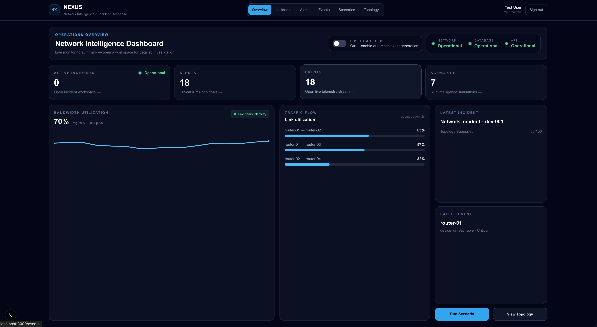
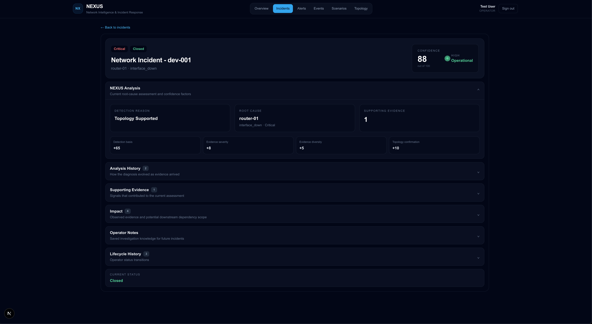
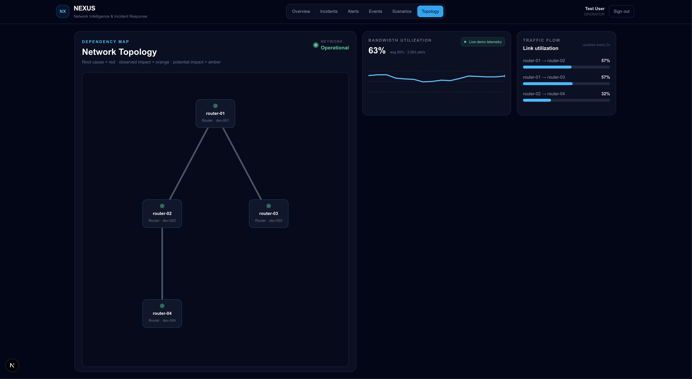
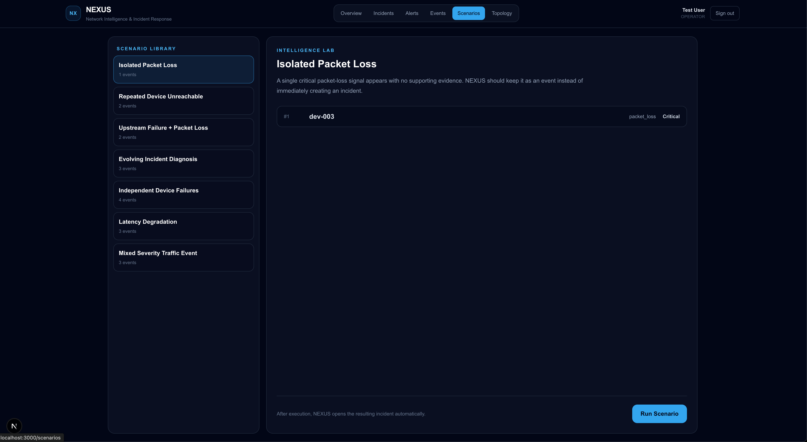
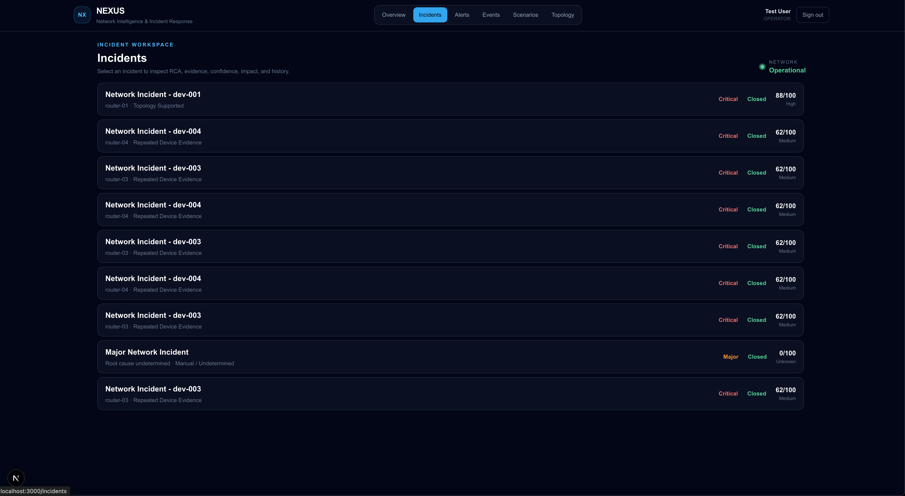
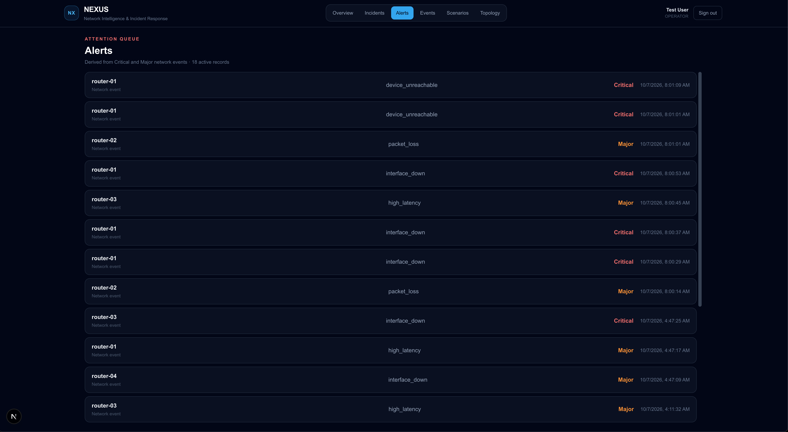
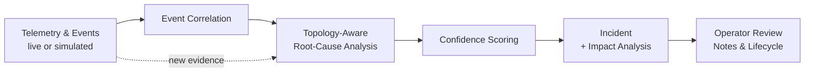
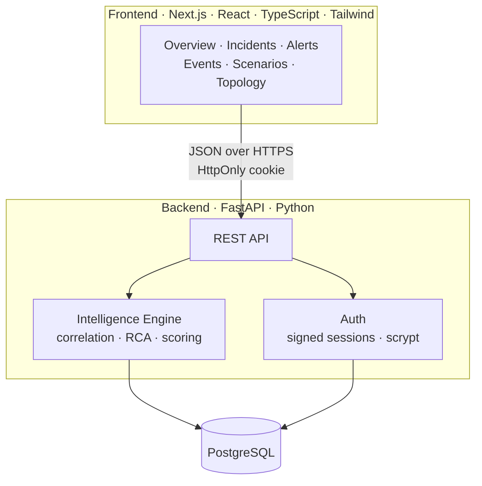

<div align="center">

# NEXUS

### Network Intelligence & Incident Response Platform

**Correlate events. Find the root cause. Know what breaks next.**

[](https://nextjs.org/)
[](https://react.dev/)
[](https://www.typescriptlang.org/)
[](https://tailwindcss.com/)
[](https://fastapi.tiangolo.com/)
[](https://www.python.org/)
[](https://www.postgresql.org/)
[](https://www.docker.com/)

<br />



</div>

---

## Overview

When a network misbehaves, operators don't get one clean alert. They get a flood of them: interface flaps, latency spikes, unreachable devices, packet loss. Most of those alerts are symptoms of a single underlying failure, and a NOC analyst has to work out which one while the clock is running.

**NEXUS** is a network intelligence and incident response platform built to shorten that gap. It ingests live or simulated telemetry, correlates related events into incidents, uses the network's **topology** to identify the most likely root cause, and attaches a transparent **confidence score** that explains *why* it reached that conclusion. As new evidence arrives, the diagnosis updates and the full history of how it changed is preserved.

> NEXUS doesn't just tell you something is wrong. It shows you what is probably causing it, how sure it is, what else may be affected, and how that picture changed over time.

---

## Key Features

| | Feature | What it does |
|---|---|---|
| 🔗 | **Event correlation** | Groups related network events into a single incident instead of flooding operators with isolated alerts. |
| 🧭 | **Topology-aware root-cause analysis** | Uses device dependencies to distinguish the failing upstream device from the downstream devices merely reporting symptoms. |
| 📊 | **Explainable confidence scoring** | Every diagnosis gets a 0–100 score broken into named factors (detection basis, evidence severity, evidence diversity, topology confirmation), so analysts can see how the number was built. |
| 🕰️ | **Evolving diagnosis** | Root-cause assessments are re-evaluated as new evidence arrives, and each revision is kept in an analysis history. |
| 💥 | **Impact analysis** | Separates *observed* impact from *potential* downstream impact based on dependency scope. |
| 🔄 | **Incident lifecycle tracking** | Operator status transitions are recorded for a complete audit trail. |
| 📝 | **Operator notes** | Investigation knowledge is saved with the incident so it's available for future ones. |
| 🧪 | **Scenario simulation lab** | A library of 7 scripted failure scenarios lets you replay situations (isolated packet loss, repeated unreachable devices, upstream failure with downstream loss, and more) and watch NEXUS reason through them. |
| 📡 | **Live demo telemetry** | Simulated bandwidth and per-link traffic-flow visualizations, with an optional automatic event generation feed. |
| 🔐 | **Secure authentication** | Session-based auth with signed tokens, HttpOnly cookies, and scrypt password hashing. |

---

## Screenshots

<table>
  <tr>
    <td width="50%">
      <strong>Operations Overview</strong><br />
      
    </td>
    <td width="50%">
      <strong>Incident Analysis & Confidence Scoring</strong><br />
      
    </td>
  </tr>
  <tr>
    <td width="50%">
      <strong>Network Topology & Dependency Map</strong><br />
      
    </td>
    <td width="50%">
      <strong>Scenario Intelligence Lab</strong><br />
      
    </td>
  </tr>
  <tr>
    <td width="50%">
      <strong>Incident Workspace</strong><br />
      
    </td>
    <td width="50%">
      <strong>Alerts & Telemetry Stream</strong><br />
      
    </td>
  </tr>
</table>

---

## How It Works



1. **Ingest.** Network events (`interface_down`, `device_unreachable`, `packet_loss`, `high_latency`) arrive from live or simulated telemetry, each tagged with a device and severity.
2. **Correlate.** Related events are grouped together rather than treated as independent alerts.
3. **Locate the root cause.** The dependency map is consulted to find which device is the likely origin and which are downstream symptoms.
4. **Score.** A confidence score is assembled from explicit, visible factors. For example, an incident might score `88/100`: detection basis `+65`, evidence severity `+8`, evidence diversity `+5`, topology confirmation `+10`.
5. **Track.** As more evidence arrives, the analysis is revised, and every revision is stored alongside operator notes and status transitions.

### Why explainable scoring?

Black-box "AI says it's the router" output isn't useful during an outage. Operators need to know *what the conclusion rests on*. NEXUS deliberately uses a transparent, rule-based scoring model so every point of confidence can be traced to a specific piece of evidence, and so behavior is deterministic and testable.

---

## Tech Stack

### Frontend
| Technology | Role |
|---|---|
| **Next.js** | App framework, routing, and server-side rendering |
| **React** | Component-based UI for dashboards, incident workspaces, and topology views |
| **TypeScript** | End-to-end type safety across components and API contracts |
| **Tailwind CSS** | Utility-first styling for a responsive, consistent dark operations-console UI |

### Backend
| Technology | Role |
|---|---|
| **FastAPI** | High-performance async REST API layer |
| **Python** | Core language for correlation, root-cause, and scoring logic |
| **REST + JSON** | Clean, documented API communication between frontend and backend |

### Data
| Technology | Role |
|---|---|
| **PostgreSQL** | Relational storage for events, incidents, analysis history, notes, and users |
| **Psycopg** | PostgreSQL driver for direct, explicit database access |

### Security
| Technology | Role |
|---|---|
| **Session-based auth** | Signed session tokens delivered via **HttpOnly cookies** |
| **scrypt** | Memory-hard password hashing |

### Quality & Testing
| Technology | Role |
|---|---|
| **Pytest** | Backend unit and logic tests (correlation, RCA, scoring) |
| **Vitest** | Frontend and unit tests |

### DevOps & Tooling
| Technology | Role |
|---|---|
| **Docker / Docker Compose** | Reproducible multi-service environment |
| **Git & GitHub** | Version control and collaboration |
| **VS Code & IntelliJ IDEA** | Development environments |

### Custom Network Intelligence Logic
Built from scratch for this project, not pulled from a library:
- Event correlation engine
- Topology-aware root-cause analysis
- Confidence scoring with itemized factors
- Incident lifecycle tracking
- Dependency mapping and impact scoping

---

## Architecture



The frontend and backend are fully decoupled and communicate only through the REST API, so either side can be developed, tested, and deployed independently.

---

## Getting Started

### Prerequisites

- [Docker](https://www.docker.com/) and Docker Compose  
  *or*, to run services individually: Node.js 18+, Python 3.11+, and PostgreSQL

### Run with Docker Compose

```bash
git clone https://github.com/lsequx/nexus.git
cd nexus

docker compose up --build
```

Then open **http://localhost:3000**, create an account, and sign in.

### Run locally (without Docker)

**Backend**
```bash
cd backend
python -m venv .venv
source .venv/bin/activate        # Windows: .venv\Scripts\activate
pip install -r requirements.txt
uvicorn app.main:app --reload
```

**Frontend**
```bash
cd frontend
npm install
npm run dev
```

### Try it out

1. Sign in and open the **Scenarios** tab.
2. Pick a scenario such as *Upstream Failure + Packet Loss* and click **Run Scenario**.
3. NEXUS opens the resulting incident automatically. Expand **NEXUS Analysis** to see the root cause and the factor-by-factor confidence breakdown.
4. Check **Topology** to see how the dependency map relates to what was diagnosed.
5. Toggle **Live Demo Feed** on the Overview page to watch automatic event generation and live telemetry.

### Running the tests

```bash
# Backend
cd backend && pytest

# Frontend
cd frontend && npm test
```

---

## Scenario Library

NEXUS ships with scripted scenarios so its reasoning can be demonstrated and regression-tested on demand.

| Scenario | Events | What it demonstrates |
|---|:---:|---|
| Isolated Packet Loss | 1 | A single signal with no corroboration stays an *event*, not an incident |
| Repeated Device Unreachable | 2 | Repeated evidence on one device escalates to an incident |
| Upstream Failure + Packet Loss | 2 | Topology separates the true root cause from downstream symptoms |
| Evolving Incident Diagnosis | 3 | The assessment is revised as new evidence arrives |
| Independent Device Failures | 4 | Unrelated failures aren't wrongly merged into one incident |
| Latency Degradation | 3 | Performance issues correlated without a hard outage |
| Mixed Severity Traffic Event | 3 | Critical and major signals weighed together |

---

## Project Structure

```
nexus/
├── backend/      # FastAPI service: REST API, auth, correlation / RCA / scoring engine
├── frontend/     # Next.js app: dashboard, incident workspace, topology, scenarios
└── README.md
```

---

## Design Decisions

- **Explainability over magic.** Confidence is an itemized sum of named factors, not an opaque number.
- **Topology as a first-class input.** Knowing *how* devices depend on each other is what turns a pile of alerts into a root cause.
- **Don't over-escalate.** A lone, uncorroborated signal remains an event. Incidents are created when the evidence justifies it, which reduces alert fatigue.
- **Audit trail built in.** Analysis history and lifecycle transitions are stored, so an incident can be reviewed after the fact.
- **Secure by default.** HttpOnly cookies keep session tokens out of reach of client-side scripts, and scrypt protects stored passwords.
- **Testable core.** Intelligence logic lives in the backend, separate from the UI, and is covered by Pytest.

---

## Roadmap

- [ ] Ingest real telemetry (SNMP, syslog, streaming telemetry)
- [ ] Highlight root cause and impact directly on the topology map
- [ ] Role-based access control beyond the Operator role
- [ ] Notifications and webhooks (Slack, email, PagerDuty)
- [ ] Exportable incident / post-incident reports
- [ ] CI pipeline with automated test runs

---

## About

NEXUS is an independent project built to explore how topology awareness and transparent scoring can make incident response faster and more consistent. It isn't trying to replace enterprise monitoring suites. It's a focused, end-to-end demonstration of full-stack engineering, API design, secure authentication, data modeling, and domain-driven logic for network operations.

**Built by Lokesh Sequeira** · [GitHub](https://github.com/lsequx)

---

<div align="center">

If you found this project interesting, consider giving it a ⭐

</div>
